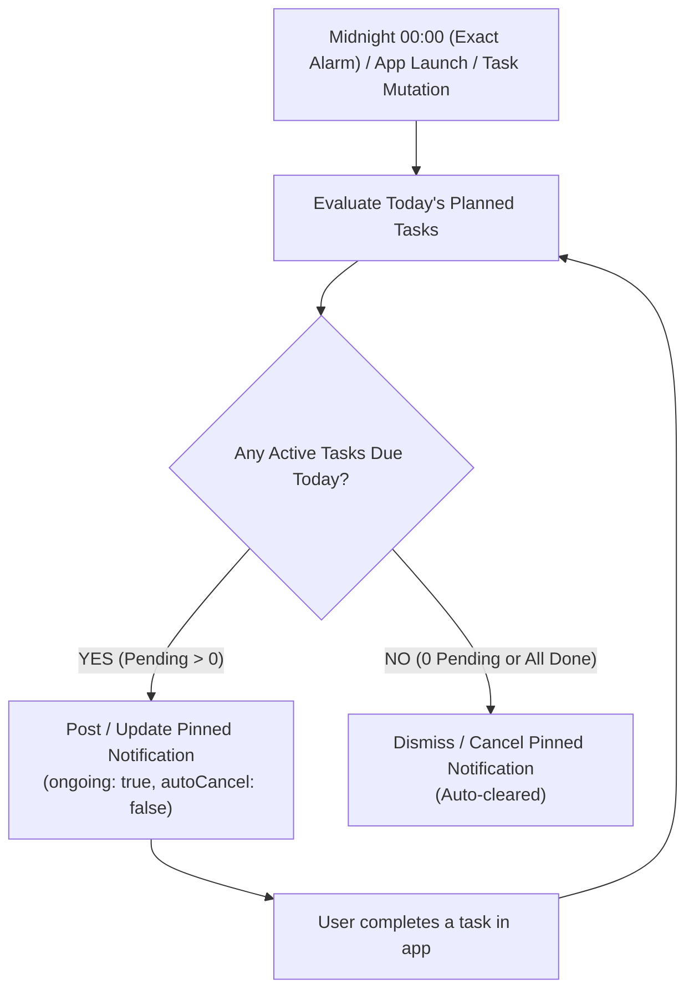

# Implementation Plan: Daily Midnight Pinned Task Notification

> **Feature**: Pin all planned tasks for the day in the Android notification shade starting at 00:00 (12:00 AM) with `ongoing: true` (cannot be cleared by user). The notification automatically updates as tasks are marked complete and dismisses when all tasks for the day are completed or when no tasks are scheduled.

---

## 1. Architectural Overview

### Key Technical Specs:
- **Android Notification Properties**:
  - `ongoing: true`: Pinned to the notification area; user cannot swipe to clear.
  - `autoCancel: false`: Does not disappear on tap.
  - `onlyAlertOnce: true`: Updates silently when tasks are checked off without buzzing/ringing every time.
  - `importance: Importance.low` / `priority: Priority.default`: Clean persistent presence in the shade.
  - `styleInformation: InboxStyleInformation` or `BigTextStyleInformation`: Displays remaining tasks as readable bullet items with time/title.
- **Timing & Triggering**:
  - **Exact Midnight Alarm**: Uses `flutter_local_notifications`'s `zonedSchedule` with `AndroidScheduleMode.exactAllowWhileIdle` set to `00:00:00` local time.
  - **Live Reactive Sync**: Whenever the user creates, updates, deletes, or completes a task, the pinned notification is re-evaluated immediately.
  - **App Lifecycle & Boot Resumption**: Re-evaluated on app launch/resume and restored after reboot via `ScheduledNotificationBootReceiver`.
- **Dismissal Criteria**:
  - The pinned notification is automatically cancelled when:
    1. The last remaining task for today is marked completed.
    2. There are no tasks planned/scheduled for today.

---

## 2. Affected Files & Changes

| File | Changes |
| :--- | :--- |
| [`lib/core/constants/app_constants.dart`](file:///d:/Code/My%20Projects/todo/lib/core/constants/app_constants.dart) | Add pinned notification channel constants (`pinnedChannelId`, `pinnedChannelName`, `pinnedChannelDescription`). |
| [`lib/core/notifications/notification_service.dart`](file:///d:/Code/My%20Projects/todo/lib/core/notifications/notification_service.dart) | Implement `showOrUpdateDailyPinnedNotification({required List<Task> tasks, required int totalTodayCount})`, `cancelDailyPinnedNotification()`, and `scheduleMidnightPinnedNotification(...)`. |
| [`lib/features/todo/presentation/providers/task_providers.dart`](file:///d:/Code/My%20Projects/todo/lib/features/todo/presentation/providers/task_providers.dart) | Add a provider or listener (`syncDailyPinnedNotificationProvider`) that watches today's active tasks and triggers notification sync. |
| [`lib/features/todo/presentation/screens/home_screen.dart`](file:///d:/Code/My%20Projects/todo/lib/features/todo/presentation/screens/home_screen.dart) | Call notification sync on task toggle/delete and during app resume. |
| [`lib/shared/widgets/app_scaffold.dart`](file:///d:/Code/My%20Projects/todo/lib/shared/widgets/app_scaffold.dart) | Integrate `AppLifecycleListener` to refresh the pinned notification when app resumes across midnight. |
| [`test/unit/notification_service_test.dart`](file:///d:/Code/My%20Projects/todo/test/unit/) | Unit test for daily pinned notification formatting, task filtering, and auto-dismiss logic. |

---

## 3. Implementation Steps (5 Tasks)

### Task 1: Notification Channel & Pinned Notification Logic
- Add `pinnedChannelId = 'taskflow_pinned_tasks'` to `AppConstants`.
- Implement `showOrUpdateDailyPinnedNotification` with:
  - Header: `Today's Tasks • {remaining} remaining ({done}/{total} done)`
  - Body: Formatted list of pending tasks (e.g., `• 10:00 AM - Design review`, `• Buy milk`).
  - `ongoing: true`, `onlyAlertOnce: true`.

### Task 2: Auto-Dismissal & Pre-Scheduling for Midnight
- Implement auto-dismiss: if `remaining == 0`, cancel notification ID `AppConstants.pinnedNotificationId`.
- Implement `scheduleMidnightPinnedNotification`: schedules exact alarm at 00:00:00 of the next day with tomorrow's planned tasks.

### Task 3: Reactive Live Sync with Database
- In `HomeScreen` and Task Providers, trigger `syncDailyPinnedNotification()` whenever:
  - Task is marked completed or uncompleted.
  - Task is added, edited, or deleted.
  - App is opened or brought back to foreground (checking if midnight has passed).

### Task 4: Settings Option (Optional Preference)
- In `SettingsScreen`, provide a switch toggle: "Pin Today's Tasks in Notifications" (enabled by default) so users have full control.

### Task 5: Verification & Testing
- Run `flutter analyze` (ensure 0 warnings).
- Run `flutter test` (ensure all tests pass).
- Verify on device/emulator:
  - Pinned notification cannot be swiped away while tasks remain.
  - Checking off all tasks clears the notification immediately.
  - Unchecking a task restores the notification immediately.
